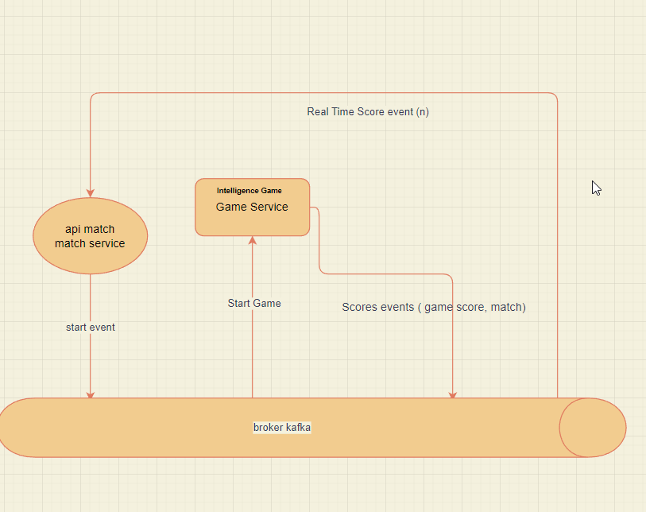

# tennis-kata

[](https://travis-ci.com/aboushaheed/tennis-kata)

**the kata**
> This Kata goal is to implement a simple tennis score computer.


          The scoring system consist in one game, divided by points :
            Each player starts a game with 0 point.
            If the player wins the 1st ball, he will have 15 points. 2nd balls won : 30 points. 3rd ball won : 40points.

            If a player have 40 points and wins the ball, he wins the game, however there are special rules.

            If both players have 40 points the players are “deuce”.

            If the game is in deuce, the winner of the ball will have advantage

            If the player with advantage wins the ball he wins the game

            If the player without advantage wins the ball they are back at “deuce”.


> Here we want you to develop a java method that will take a String as input containing 
        the character ‘A’ or ‘B’. The character ‘A’ corresponding to “player A won the ball”, 
        and ‘B’ corresponding to “player B won the ball”. The java method should print the score 
        after each won ball (for example : “Player A : 15 / Player B : 30”) and print the winner of the game.
        
        For example the following input “ABABAA” should print :
        “Player A : 15 / Player B : 0”
        “Player A : 15 / Player B : 15”
        “Player A : 30 / Player B : 15”
        “Player A : 30 / Player B : 30”
        “Player A : 40 / Player B : 30”
        “Player A wins the game


### Architecture
> I use event driven model by introducing a kafka broker as shown bellow, the frontend use React ( to be performed)
>



### How to use
### for Tennis-kata application
> Run the game-service app
> Run the match-service app
> the 2 apps with this env variables : KAFKA_HOST=localhost:9091;KAFKA_TOPIC=tennis_topic
> you have to run docker-compose for Kafka and kafdrop if you want to monitor topics
> specify different ports for you apps in VM options ( -Dserver.port=8081 ) for example
> use environment variables as KAFKA_HOST=localhost;KAFKA_TOPIC=GAME_TOPIC;
> you have a Dockerfile if you use docker
>
```yaml
version: '3'
services:
  kafka2:
    image: confluentinc/cp-kafka:5.3.0
    hostname: kafka2
    ports:
      - "9091:9091"
    environment:
      KAFKA_ADVERTISED_LISTENERS: LISTENER_DOCKER_INTERNAL://kafka2:19092,LISTENER_DOCKER_EXTERNAL://${DOCKER_HOST_IP:-127.0.0.1}:9091
      KAFKA_LISTENER_SECURITY_PROTOCOL_MAP: LISTENER_DOCKER_INTERNAL:PLAINTEXT,LISTENER_DOCKER_EXTERNAL:PLAINTEXT
      KAFKA_INTER_BROKER_LISTENER_NAME: LISTENER_DOCKER_INTERNAL
      KAFKA_ZOOKEEPER_CONNECT: "zookeeper:2181"
      KAFKA_BROKER_ID: 1
      KAFKA_OFFSETS_TOPIC_REPLICATION_FACTOR: 1
    volumes:
      - ./data/kafka2/data:/var/lib/kafka2/data
    depends_on:
      - zookeeper

  zookeeper:
    image: zookeeper:3.4.9
    hostname: zookeeper
    ports:
      - "2181:2181"
    environment:
      ZOO_MY_ID: 1
      ZOO_PORT: 2181
      ZOO_SERVERS: server.1=zookeeper:2888:3888
    volumes:
      - ./data/zookeeper/data:/data
      - ./data/zookeeper/datalog:/datalog

  kafdrop:
    image: obsidiandynamics/kafdrop
    restart: "no"
    ports:
      - "9000:9000"
    environment:
      KAFKA_BROKERCONNECT: "kafka2:19092"
    depends_on:
      - kafka2
```

